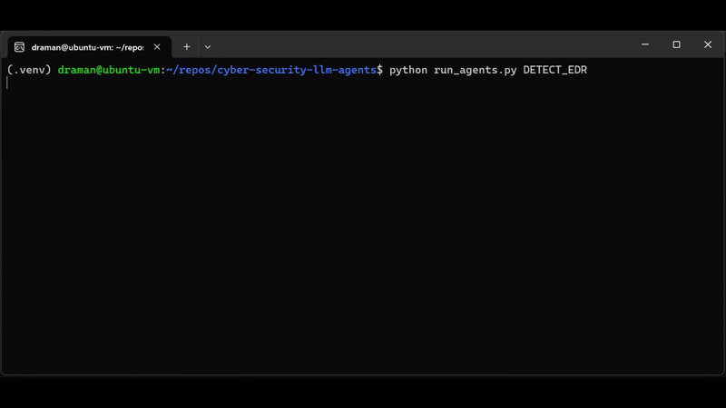

# Cyber Security LLM Agents

A cybersecurity automation framework built on top of [AutoGen](https://microsoft.github.io/autogen/) that uses Large Language Models (LLMs) to drive agent workflows for red team, blue team, and detection engineering tasks.

Released as part of RSAC 2024 talks:
- [From Chatbot to Destroyer of Endpoints: Can ChatGPT Automate EDR Bypasses?](https://www.rsaconference.com/USA/agenda/session/From%20Chatbot%20to%20Destroyer%20of%20Endpoints%20Can%20ChatGPT%20Automate%20EDR%20Bypasses)
- [The Always-On Purple Team: An Automated CI/CD for Detection Engineering](https://www.rsaconference.com/USA/agenda/session/The%20Always-On%20Purple%20Team%20An%20Automated%20CICD%20for%20Detection%20Engineering)

<figure align="center">
  
  <figcaption style="text-align: center;"><i>Detecting the EDR running on a Windows system based on live data extracted from https://github.com/tsale/EDR-Telemetry.</i></figcaption>
</figure>

## What this project provides

- Modular agents and workflows for common cybersecurity tasks
- Scenario-driven automation using LLMs
- Built-in support for demo servers and agent coordination
- A framework for exploring LLM-assisted threat simulation and detection engineering

## Important warning

> Running LLM-generated source code and commands carries security risks. Use this repository only in isolated or test environments.

## Quick start

1. Install dependencies:

```bash
pip install -r requirements.txt
```

2. Create a local `.env` from the template:

```bash
cp .env_template .env
```

3. Add your LLM API credentials and configuration values to `.env`.

4. (Optional) Start the demo servers:

```bash
python run_servers.py
```

5. Run the example scenario:

```bash
python run_agents.py HELLO_AGENTS
```

## Example output

A successful run should show a basic agent interaction, for example:

```text
********************************************************************************
Starting a new chat....

********************************************************************************
task_coordinator_agent (to text_analyst_agent):

Tell me a cyber security joke

--------------------------------------------------------------------------------
text_analyst_agent (to task_coordinator_agent):

Why was the computer cold? It left its Windows open.

TERMINATE
```

## Working with scenarios

All scenario definitions are located in `actions/agent_actions.py`.
Add or update an entry in the scenario dictionary, then execute:

```bash
python run_agents.py <scenario-name>
```

## Project structure

- `run_agents.py` — scenario execution entrypoint
- `run_servers.py` — starts the HTTP/FTP demo servers
- `actions/agent_actions.py` — scenario definitions and workflows
- `agents/` — agent implementations
- `tools/` — helper tools used by agents
- `utils/` — shared utilities and configuration
- `notebooks/` — demo notebooks and research examples

## Development

### Jupyter notebooks

To launch notebooks and expose them on a chosen interface:

```bash
./run_notebooks.sh <network-interface>
```

### Static analysis

This repository ignores long agent strings, so `flake8` is configured to skip a few style rules:

```bash
flake8 --exclude=.venv --ignore=E501,W503 .
```

## Contributing

Contributions are welcome. Please fork the repository, add new agents or scenarios, and submit a pull request.

## License

This project is released under the GNU General Public License v3 (GPL-3).

## Disclaimer

This repository is an early-stage project and may contain unstable or experimental components. Use it with caution and expect possible breaking changes.

## Acknowledgements

Thanks to [INNOVIRIS](https://innoviris.brussels/) and the Brussels region for supporting the research and development activities behind this project.

